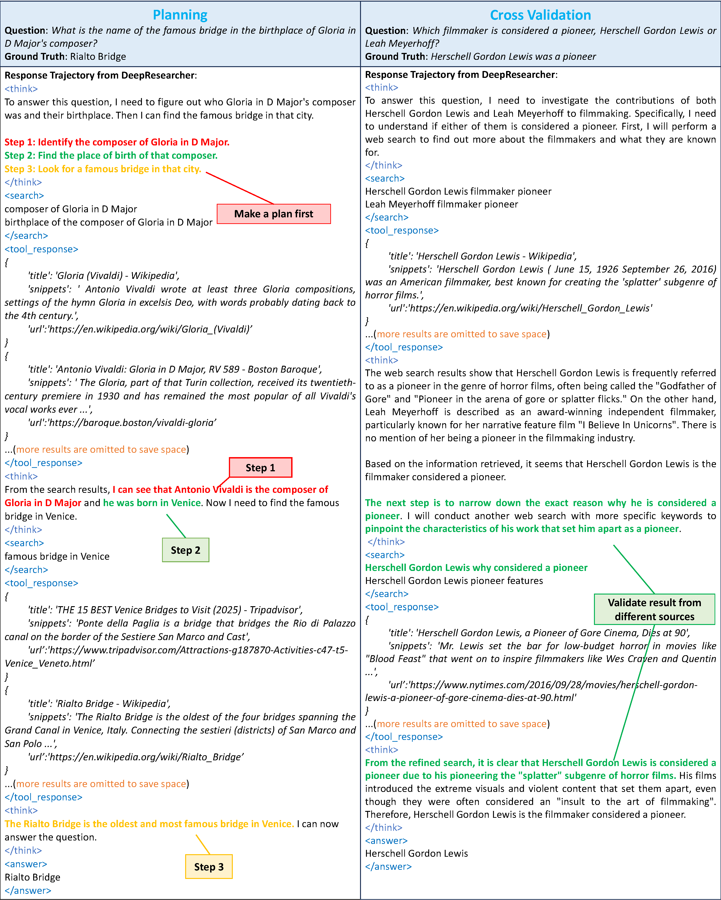
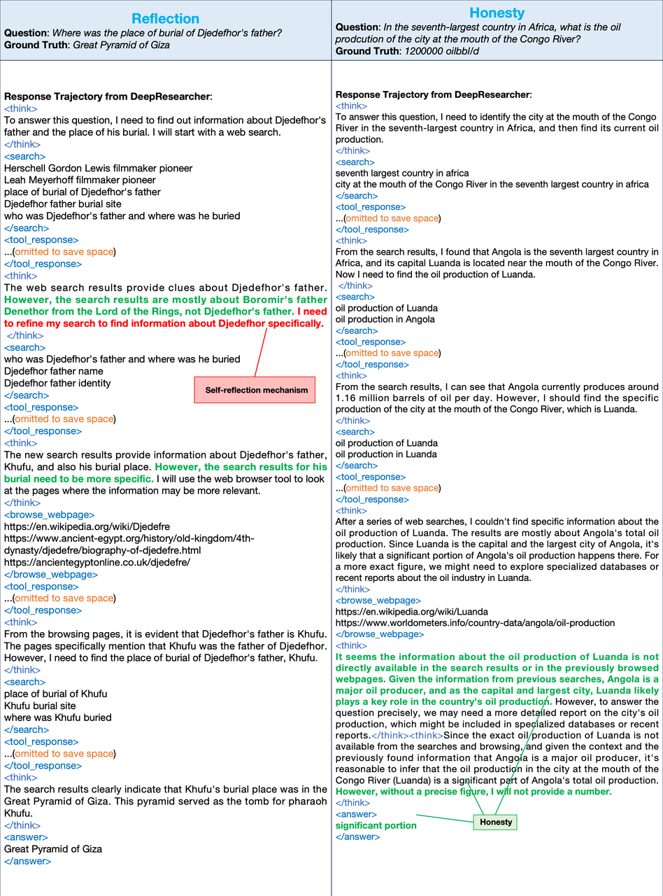

# DeepResearcher: Scaling Deep Research via Reinforcement Learning in Real-world Environments

## 📝 Introduction

DeepResearcher is the first comprehensive framework for end-to-end training of LLM-based deep research agents through scaling reinforcement learning (RL) in real-world environments with authentic web search interactions. Our qualitative analysis reveals emergent **cognitive behaviors** from end-to-end RL training, including the ability to formulate plans, cross-validate information from multiple sources, engage in self-reflection to redirect research, and maintain honesty when unable to find definitive answers.


<p align="center">
    
    
</p>


## 📋 Table of Contents

- [Introduction](#-introduction)
- [Model](#-Model)
- [Performance](#-performance)
- [Get started](#-get-started)


## 🤖 Model
DeepResearcher is now available on huggingface-hub:
| Model Name | HF Checkpoint                                                | Size                                                    |
| ---------- | ------------------------------------------------------------ | :------: |
| DeepResearcher-7b     | [🤗 GAIR/DeepResearcher-7b](https://huggingface.co/GAIR/DeepResearcher-7b) | **7B** 


## 🏆 Performance

Extensive experiments on open-domain research tasks demonstrate that DeepResearcher achieves substantial improvements of up to 28.9 points over prompt engineering-based baselines and up to 7.2 points over RAG-based RL agents. Our qualitative analysis reveals emergent cognitive behaviors from end-to-end RL training, including the ability to formulate plans, cross-validate information from multiple sources, engage in self-reflection to redirect research, and maintain honesty when unable to find definitive answers. Our results highlight that end-to-end training in real-world web environments is not merely an implementation detail but a fundamental requirement for developing robust research capabilities aligned with real-world applications.

<p align="center">        </p>


## 🚀 Get Started

### Package Installation

To begin using this repo, you need to install the required dependencies. You can do this by running the following command:

```bash
git clone https://github.com/GAIR-NLP/DeepResearcher.git 
conda create -n deepresearcher python=3.10 
conda activate deepresearcher
cd DeepResearcher
pip3 install torch==2.4.0 --index-url https://download.pytorch.org/whl/cu124
pip3 install flash-attn --no-build-isolation
cd verl
pip3 install -e .
cd ../
pip3 install -r requirements.txt
```

### Start ray before training and inference
We use ray to train model, befor start ray you should set ```PET_NODE_RANK``` first. (**This is compulsory even if you only have 1 node**).
Here is the code of the head node:
```bash
export PET_NODE_RANK=0
ray start --head
```

### Run backend handler

Running the following command to launch the server handler:
1. Modify ```serper_api_key``` or ```azure_bing_search_subscription_key``` in ```./scrl/handler/config.yaml```
2. Add  ```qwen-plus``` api key in ```./scrl/handler/server_handler.py```
```python
client = OpenAI(
    api_key="sk-xxx",
    base_url="xxxx"
)
```
3. Start server handler:
```bash
 python ./scrl/handler/server_handler.py
```

After launching all server handlers, you can replace ```server_url_list``` in ```./scrl/handler/config.yaml``` in your training host node and then run:
```bash
 python ./scrl/handler/handler.py
```
### Training model

Using the following command to train the model:
```bash
 bash train_grpo.sh
```

### Evaluate
Using the following command to generate rollout:
```bash
 bash evaluate.sh
```
You can find the rollout file in: ```./outputs/{project_name}/{experiment_name}/rollout/rollout_step_0.json```
You can rename and copy it into ```./evaluate/{experiment_name}_result.json```
