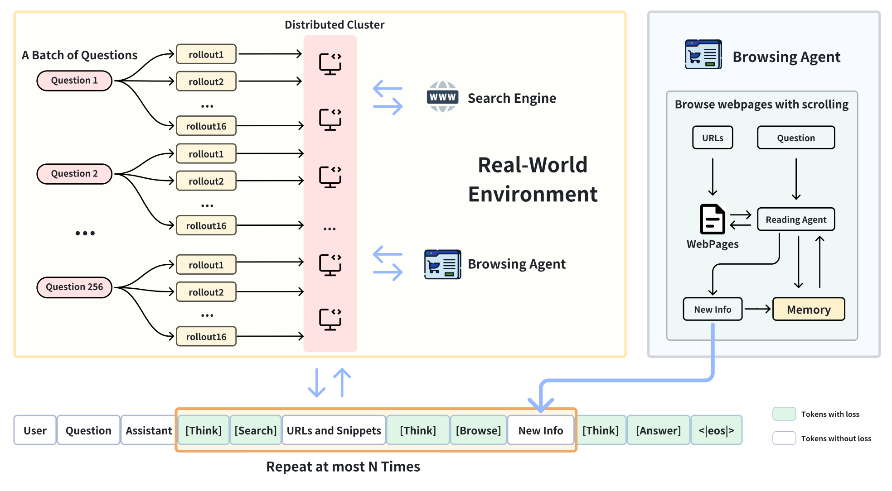
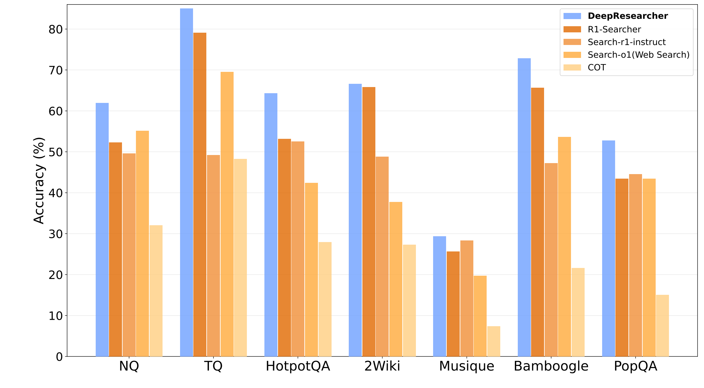

# DeepResearcher: Scaling Deep Research via Reinforcement Learning in Real-world Environments


## 📋 Table of Contents

- [Introduction](#-introduction)
- [Performance](#-performance)
- [Get started](#-get-started)


## 📝 Introduction

<p align="center">        </p>

<p align="center"> In this paper, we introduce DeepResearcher, the first comprehensive framework for end-to-end training of LLM-based deep research agents through scaling reinforcement learning (RL) in real-world environments with authentic web search interactions.

### 🤖 Model
DeepResearcher is now available on huggingface-hub:
| Model Name | HF Checkpoint                                                | Size |                                                       |
| ---------- | ------------------------------------------------------------ | :------: | ------------------------------------------------------------ |
| DeepResearcher-7b     | [🤗 GAIR/DeepResearcher-7b](https://huggingface.co/GAIR/DeepResearcher-7b) | **7B** 


## 🏆 Performance

Extensive experiments on open-domain research tasks demonstrate that DeepResearcher achieves substantial improvements of up to 28.9 points over prompt engineering-based baselines and up to 7.2 points over RAG-based RL agents. Our qualitative analysis reveals emergent cognitive behaviors from end-to-end RL training, including the ability to formulate plans, cross-validate information from multiple sources, engage in self-reflection to redirect research, and maintain honesty when unable to find definitive answers. Our results highlight that end-to-end training in real-world web environments is not merely an implementation detail but a fundamental requirement for developing robust research capabilities aligned with real-world applications.

<p align="center">        </p>


## 🚀 Get Started

### 🛠️ Setup <a name="setup"></a>

##### Install necessary packages:

To begin using this repo, you need to install the required dependencies. You can do this by running the following command:

```bash
git clone https://github.com/GAIR-NLP/DeepResearcher.git 
conda create -n deepresearcher python=3.10 
conda activate deepresearcher
cd DeepResearcher
pip install -r requirements.txt
```


